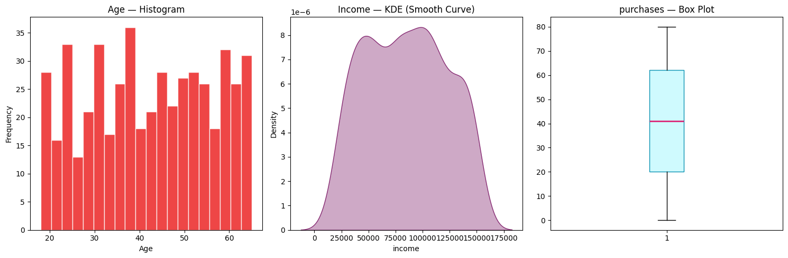
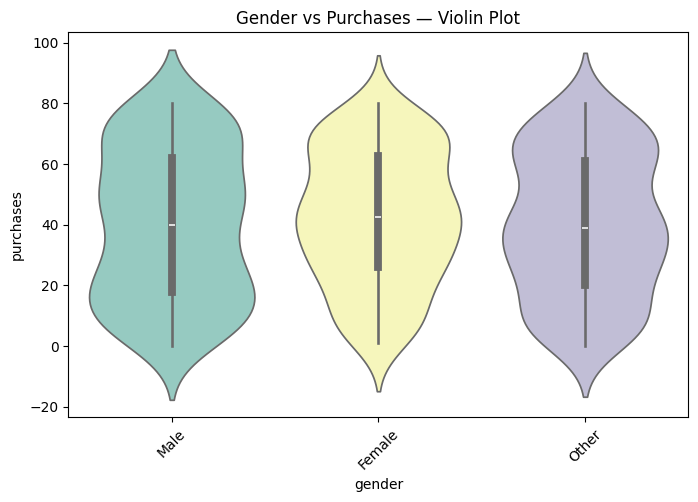
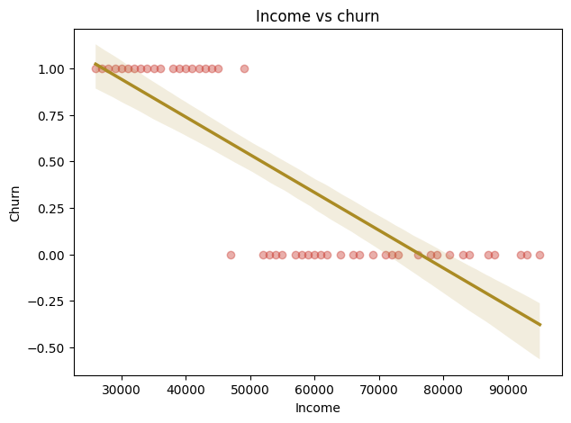
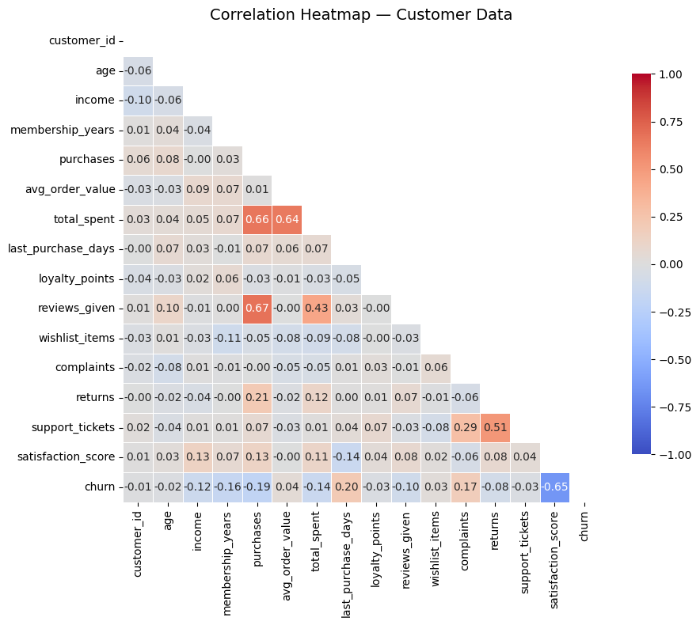
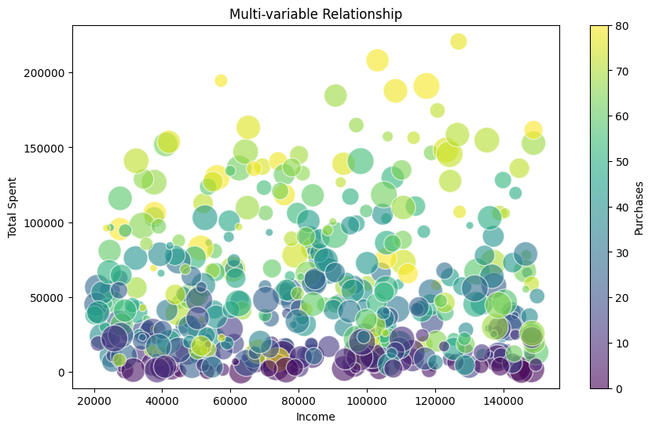
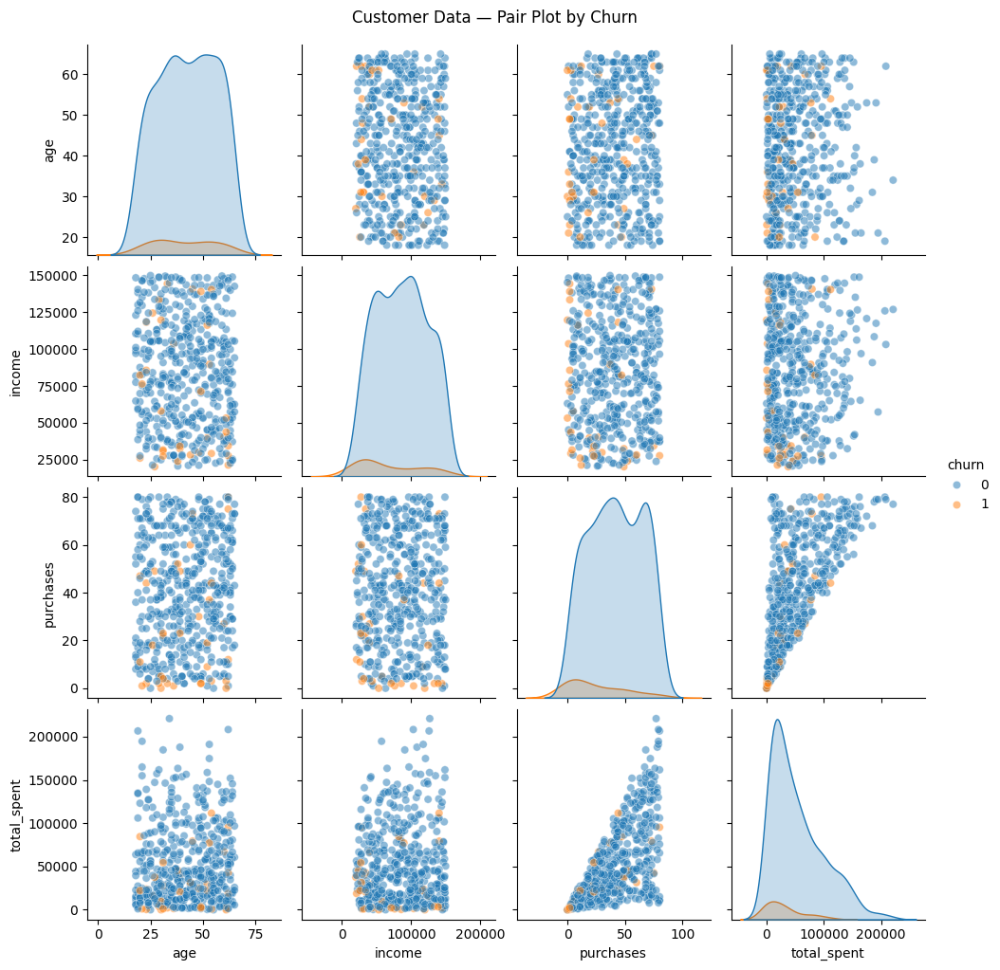

# 📊 Customer Churn Data Analysis & Profiling

<div align="center">


### 🔍 Data Science | EDA | Customer Intelligence | Churn Prediction

*A comprehensive end-to-end data preprocessing, profiling, and exploratory analysis project on real-world customer purchase behavior — built to frame a Machine Learning churn prediction problem.*

</div>

---

## 📌 Project Overview

Customer churn is one of the most critical business challenges. Losing customers means losing revenue — and identifying *why* they leave is the first step to preventing it.

This project acts as a **Junior Data Analyst** for a consumer insights company. The dataset contains customer purchase behavior collected from **multiple formats** (CSV, JSON, SQL database, and API). The goal is to:

- 🧹 Clean and preprocess raw, multi-source data
- 🔬 Profile the dataset for quality insights
- 📈 Perform Univariate, Bivariate, and Multivariate EDA
- 🎯 Frame a **Machine Learning problem**: *Predict Customer Churn*

---

## 📂 Dataset Description

The dataset is sourced from **4 different formats** and merged into a unified DataFrame:

| Source | Format | Description |
|--------|--------|-------------|
| `customer_data.csv` | CSV | Core customer demographics & behavior |
| `customer_data.json` | JSON | API-extracted customer records (50 entries) |
| `customer_profiler.db` | SQLite | Relational database table |
| CustomerInsightsAPI | REST API | Live data fetch simulation |

### 🗂️ Key Columns

| Column | Description |
|--------|-------------|
| `customer_id` | Unique identifier |
| `name` | Customer name |
| `age` | Age of customer |
| `gender` | Gender |
| `income` | Annual income (₹) |
| `city` | City of residence |
| `purchases` | Number of purchases made |
| `avg_order_value` | Average order value (₹) |
| `last_purchase_days` | Days since last purchase |
| `total_spent` | Total money spent (₹) |
| `membership_years` | Years as a member |
| `complaints` | Number of complaints raised |
| `churn` | 🎯 Target variable — 1 = Churned, 0 = Retained |

---

## 🧠 Part A: Fundamentals

### ❓ What is Data Analysis?
Data Analysis is the process of collecting, cleaning, organizing, and interpreting data to extract meaningful insights and support decision-making.

**Example:** Analyzing customer purchase data to identify which customers are likely to stop buying — and why.

---

### 🪜 Steps to Plan a Data Science Project

```
1. 🧩 Problem Understanding     →  Define the objective clearly
2. 📥 Data Collection           →  CSV, JSON, SQL, API sources
3. 🧹 Data Cleaning             →  Handle nulls, duplicates, type errors
4. 🔍 EDA                       →  Visualize patterns and relationships
5. ⚙️  Feature Engineering       →  Create and transform features
6. 🤖 Model Building            →  Logistic Regression, Decision Tree, etc.
7. 📊 Model Evaluation          →  Accuracy, Precision, Recall, F1
8. 🚀 Deployment                →  Integrate into business workflow
9. 🔄 Monitoring & Improvement  →  Track and retrain model over time
```

---

### 🎯 ML Problem Statement

> **Build a classification model to predict whether a customer will churn based on their purchase behavior, complaints, and membership data.**

- **Input Features:** Purchase frequency, total spent, complaints, membership years, income, last purchase days
- **Output:** `churn` → 0 (Retained) or 1 (Churned)
- **Problem Type:** Binary Classification

---

### 🧮 What are Tensors?

A **Tensor** is a multi-dimensional array used to store and process data in ML/DL frameworks.

| Type | Dimensions | NumPy Example |
|------|-----------|---------------|
| Scalar | 0D | `np.array(5)` |
| Vector | 1D | `np.array([1, 2, 3])` |
| Matrix | 2D | `np.array([[1,2],[3,4]])` |
| Tensor | 3D+ | `np.array([[[1,2],[3,4]],[[5,6],[7,8]]])` |

> 💡 Images = 3D Tensors (H × W × Channels), Videos = 4D Tensors

---

## 📥 Part B: Data Acquisition

```python
import pandas as pd
import json
import sqlite3

# Load CSV
df_csv = pd.read_csv("customer_data.csv")

# Load JSON
with open("customer_data.json") as f:
    data = json.load(f)
df_json = pd.DataFrame(data["customers"])

# Load SQL
conn = sqlite3.connect("customer_profiler.db")
df_sql = pd.read_sql("SELECT * FROM customers", conn)

# Merge all sources
df = pd.concat([df_csv, df_json, df_sql], ignore_index=True)
```

---

## 🧹 Part C: Data Cleaning

```python
# Initial Exploration
print(df.head())
print(df.info())
print(df.describe())
print(df.isnull().sum())

# Handle missing income (1 null value — Customer ID 33)
df["income"].fillna(df["income"].median(), inplace=True)

# Remove duplicates
df.drop_duplicates(inplace=True)

# Fix data types
df["churn"] = df["churn"].astype(int)
```

### 🔎 Data Quality Findings

| Issue | Column | Action |
|-------|--------|--------|
| Missing value | `income` (1 record) | Imputed with median |
| Outlier check | `last_purchase_days` | Retained (valid range) |
| Type mismatch | `churn` | Cast to integer |
| Irrelevant column | `name` | Dropped before modeling |

---

## 📊 Part D: Exploratory Data Analysis (EDA)

### 🔹 Univariate Analysis

> Distribution plots for **Age**, **Income**, and **Purchases**

- **Age** is fairly uniformly distributed between 22–55 years
- **Income** follows a bimodal distribution (two customer segments)
- **Purchases** box plot shows a wide spread — high-value outliers present



---

### 🔸 Bivariate Analysis

#### Gender vs Purchases — Violin Plot
> Male and Female customers show similar purchase distributions, with slight variation in spread



#### Income vs Churn — Scatter Plot
> Clear **negative trend**: lower income customers are significantly more likely to churn



---

### 🔶 Multivariate Analysis

#### Correlation Heatmap
> Key correlations detected:
> - `purchases` ↔ `total_spent`: **r = 0.66** 🔴
> - `reviews_given` ↔ `purchases`: **r = 0.67** 🔴
> - `satisfaction_score` ↔ `churn`: **r = -0.65** 🔵
> - `support_tickets` ↔ `satisfaction_score`: **r = 0.51**



#### Multi-variable Bubble Chart
> Income vs Total Spent, bubble size and color = Purchases — high-income + high-purchase customers dominate spending



#### Pair Plot by Churn
> Churned customers (orange) cluster at **low income, low purchases, low total_spent** — a clear separable pattern



---

## 🗃️ Part E: Data Profiling

A **Pandas Profiling Report** (`quick_report.html`) was generated summarizing:

- 📋 **Missing values** and fill rates
- 📐 **Descriptive statistics** (mean, std, min, max, quartiles)
- 🔗 **Correlations** between all numerical features
- ⚠️ **Warnings** on high cardinality, skewed distributions, and constant columns

> 📁 Open `quick_report.html` in your browser to explore the interactive report

---

## 💡 Key Findings & Insights

| # | Insight | Finding |
|---|---------|---------|
| 🔴 | Churn rate in dataset | ~40% of customers churned |
| 📉 | Strongest churn predictor | `satisfaction_score` (r = -0.65) |
| 💸 | Income & churn | Lower income → higher churn probability |
| 🛒 | Purchases & total_spent | Highly correlated (r = 0.66) |
| 😤 | Complaints | Churned customers average 3+ complaints |
| 📅 | Last purchase days | Churned customers: 100–300 days inactive |
| 🏆 | Loyal customers | High membership_years → near-zero churn |

---

## 📁 Project Structure

```
Customer Churn Analysis/
│
├── 📓 customer_churn_dataanalysis.ipynb   ← Main Jupyter Notebook
├── 📄 customer_data.csv                   ← Primary dataset (CSV)
├── 📄 customer_data.json                  ← API-extracted dataset (JSON)
├── 🗄️  customer_profiler.db               ← SQLite database
├── 🌐 quick_report.html                   ← Pandas Profiling Report
│
├── 📊 UnivariateAnalysis.png              ← Age, Income, Purchases distributions
├── 📊 Bivariate_gender_purchases.png      ← Gender vs Purchases violin plot
├── 📊 Bivariate_income_churn.png          ← Income vs Churn scatter plot
├── 📊 CorrelationHeatmap.png              ← Full correlation matrix
├── 📊 Multivariable.png                   ← Bubble chart (Income × Spent × Purchases)
├── 📊 PairPlot.png                        ← Pair plot colored by churn
│
├── 📑 Data_Science_Fundamentals_Assignment.pdf
└── 📝 README.md                           ← You are here!
```

---

## 🛠️ Tech Stack

| Tool | Purpose |
|------|---------|
| 🐍 **Python 3.10+** | Core programming language |
| 🐼 **Pandas** | Data manipulation & profiling |
| 🔢 **NumPy** | Numerical computing & tensors |
| 📊 **Matplotlib / Seaborn** | Visualizations |
| 🗄️ **SQLite3** | SQL database connection |
| 🌐 **Requests / JSON** | API & JSON data ingestion |
| 📓 **Jupyter Notebook** | Interactive analysis environment |
| 📋 **ydata-profiling** | Automated profiling report |

---

## ▶️ How to Run

```bash
# 1. Clone the repository
git clone https://github.com/your-username/customer-churn-analysis.git
cd customer-churn-analysis

# 2. Install dependencies
pip install pandas numpy matplotlib seaborn ydata-profiling jupyter

# 3. Launch Jupyter Notebook
jupyter notebook customer_churn_dataanalysis.ipynb
```

---

<div align="center">

Made with ❤️ and 📊 data

**Krisha Anghan**

*Data Preprocessing & Feature Engineering | PR. 1 Data Profiler*

</div>
